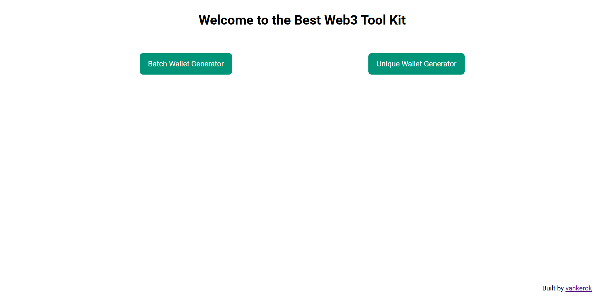
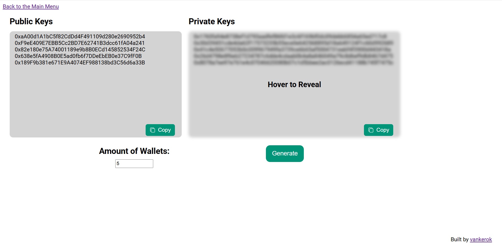
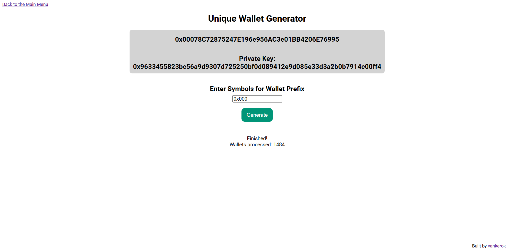

Welcome to the repository of my **Wallet Generation Website**! This is a web-based mini-platform where you can generate large amounts of wallets or create unique ones that start with a prefix that fits your stylistic choice. 



## Functionality
The project has two functions at the moment:

### Batch Wallet Generation
Generating wallets in large amounts



### Unique Wallet Generation
Generating wallets starting with unique symbols



## Installation
1. Clone the repository:
``` bash
git clone https://github.com/vankerok/wallet-generator-website
```

2. Navigate to the project directory:
```bash
cd wallet-generator-website
```

## Usage
1. Once you've cloned the necessary repository, run the website locally by opening index.html in your chosen browser